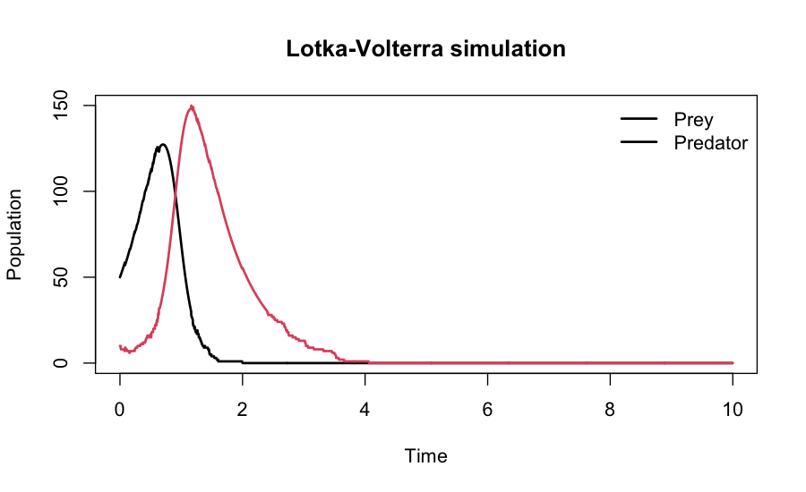

# rjsf

<!-- badges: start -->
<!-- badges: end -->

`rjsf` provides an R interface to Jump-Switch-Flow (JSF), a hybrid simulation framework for compartmental models that combines stochastic jump dynamics at low populations with deterministic flow dynamics at high populations.

**Important:** `rjsf` is an R interface; running simulations requires the Python Jump-Switch-Flow backend to be installed and accessible through `reticulate`.

The main function is `jsf_simulate()`, which lets users define compartmental reaction models in R, run simulations using the Python `jsf` backend, and return the output as either a regular `data.frame` or a structured `JSFResult` object.

## Installation

Once available on CRAN, you can install the released version of `rjsf` with:

```r
install.packages("rjsf")
```

You can install the development version from GitHub with:

```r
# install.packages("pak")
pak::pak("olivervu25/rjsf")
```

Running simulations also requires the Python Jump-Switch-Flow backend. See [Python setup](#python-setup) below.

## Python setup

`rjsf` uses `reticulate` to communicate with the Python `jsf` package. The Python backend must therefore be installed in the same Python environment used by `reticulate`.

A recommended setup is to create a local virtual environment:

```bash
python3 -m venv .venv
source .venv/bin/activate

python -m pip install --upgrade pip setuptools wheel
python -m pip install numpy scipy pandas matplotlib python-libsbml
python -m pip install git+https://github.com/DGermano8/jsf
```

Then in R, point `reticulate` to that environment:

```r
Sys.setenv(RETICULATE_PYTHON = ".venv/bin/python")

library(reticulate)
py_config()
```

Check that the Python `jsf` backend is available:

```r
library(rjsf)

jsf_available()
```

A correctly configured environment should return:

```text
[1] TRUE
```

## Alternative setup using reticulate

You can also create and configure the Python environment directly from R:

```r
library(reticulate)

virtualenv_create("rjsf-env")

py_install(
  packages = c(
    "numpy",
    "scipy",
    "pandas",
    "matplotlib",
    "python-libsbml"
  ),
  envname = "rjsf-env",
  method = "virtualenv"
)

py_install(
  packages = "git+https://github.com/DGermano8/jsf",
  envname = "rjsf-env",
  method = "virtualenv",
  pip = TRUE
)

use_virtualenv("rjsf-env", required = TRUE)
```

Then check:

```r
library(rjsf)

jsf_available()
```

## Quick example

The following example simulates a Lotka-Volterra predator-prey system and returns a structured `JSFResult` object.

```r
library(rjsf)
library(reticulate)

rates_lv <- reticulate::py_eval(
  "lambda x, t: [2.0 * x[0], 1.5 * x[1], 0.05 * x[0] * x[1]]"
)

result <- jsf_simulate(
  x0 = c(prey = 50, predator = 10),
  rates = rates_lv,
  reactant = matrix(
    c(
      1, 0,
      0, 1,
      1, 1
    ),
    ncol = 2,
    byrow = TRUE
  ),
  product = matrix(
    c(
      2, 0,
      0, 0,
      0, 2
    ),
    ncol = 2,
    byrow = TRUE
  ),
  do_disc = c(1, 1),
  t_max = 10,
  dt = 0.01,
  switching_threshold = c(30, 30),
  species_names = c("prey", "predator"),
  return_type = "JSFResult"
)

result
summary(result)
plot(result)
```

The simulated prey and predator trajectories can be visualised directly from the `JSFResult` object:



## Output types

`jsf_simulate()` can return either a regular data frame:

```r
df <- jsf_simulate(..., return_type = "data.frame")
```

or a structured `JSFResult` object:

```r
result <- jsf_simulate(..., return_type = "JSFResult")
```

A `JSFResult` stores simulation trajectories and associated metadata and supports standard methods including:

```r
print(result)
summary(result)
plot(result)
```

## Vignettes

See the [Getting started with rjsf](vignettes/getting-started.qmd) vignette for complete Lotka-Volterra and SIR examples, including model specification, Python setup, simulation, and result inspection.

## Citation

If you use `rjsf` in your work, please cite both the `rjsf` package and the original Jump-Switch-Flow methodology.

You can obtain the recommended citations in R with:

```r
citation("rjsf")
```

The upstream Python implementation of Jump-Switch-Flow is available at:

https://github.com/DGermano8/jsf
